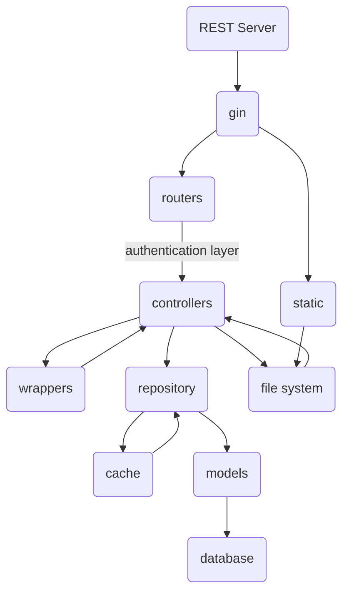

# API

## Architecutre

- **v1, v2**...: represent various versions of API's
  - **routers**: all the routes
  - **controllers**: operations that need to performed to serve the request go here for all the specific routes
- **models**: will hold the data models
- **middlewares**: will hold route-middlewares
- **repository**: will hold all the operations that are to be performed on database using the data-model
- **wrappers**: will hold response/request wrappers and converters

